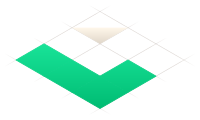
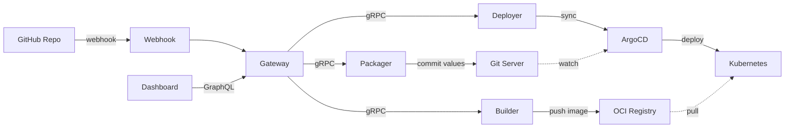

<p align="center">
  <picture>
    <source media="(prefers-color-scheme: dark)" srcset="assets/logo-dark.svg">
    
  </picture>
</p>

<h1 align="center">Lucity</h1>

<p align="center">
  Open-source PaaS on Kubernetes. Railway-like DX, full ejectability.
</p>

<p align="center">
  <a href="https://github.com/zeitlos/lucity/actions/workflows/release.yml">
    
  </a>
  <a href="https://github.com/zeitlos/lucity/blob/main/LICENSE">
    
  </a>
  <a href="https://go.dev/">
    
  </a>
</p>

---

Lucity is a self-hosted PaaS that deploys your apps to Kubernetes from a GitHub repo. It gives you the developer experience of Railway or Heroku with the control of owning your infrastructure. When you're ready to move on, `lucity eject` gives you standard Helm charts and ArgoCD configs — zero lock-in, zero vendor dependency.

<!-- TODO: Demo GIF
     Record with VHS (https://github.com/charmbracelet/vhs) or screen-record the dashboard:
     1. Create project from GitHub repo
     2. Service auto-detection
     3. Build + deploy with live logs
     4. Open the running app via platform domain
     Place at assets/demo.gif and uncomment:
     <p align="center">
       
     </p>
-->

## Features

**Deploy**

- [x] Git push to deploy from any GitHub repo
- [x] Auto-detect language, framework, and port
- [x] Async builds with real-time log streaming
- [x] Rolling deployments with rollback

**Environments**

- [x] Development, staging, and production out of the box
- [x] Ephemeral PR preview environments
- [x] Promote between environments without rebuilding

**Infrastructure**

- [x] PostgreSQL databases via CloudNativePG
- [x] Redis instances
- [x] Cron jobs
- [x] Custom domains with DNS verification

**Operations**

- [x] Environment variables — shared, per-service, database refs
- [x] Database explorer with query execution
- [x] Deploy and service log streaming
- [x] Full GraphQL API

**Ejectability**

- [x] `lucity eject` exports your Helm charts and ArgoCD configs
- [x] Ejected output is fully self-contained — zero Lucity dependencies
- [x] Standard tools all the way down: Helm, ArgoCD, Gateway API, CloudNativePG

## Architecture



The platform is **stateless** — no central database. All state lives in Git (Soft-serve), Kubernetes, and the OCI registry (Zot). Your source repo is read-only to the platform; all managed configuration lives in a separate GitOps repo. If the platform goes down, your workloads keep running.

## Quick Start

Install with Helm:

```sh
helm install lucity oci://ghcr.io/zeitlos/lucity/charts/lucity \
  --namespace lucity-system --create-namespace
```

For local development, see the [Contributing guide](CONTRIBUTING.md).

## Tech Stack

| Component | Technology |
|-----------|-----------|
| Runtime | Kubernetes |
| Builds | [railpack](https://github.com/nichochar/railpack) |
| GitOps | [ArgoCD](https://argoproj.github.io/cd/) + [Helm](https://helm.sh/) |
| Networking | [Gateway API](https://gateway-api.sigs.k8s.io/) (Envoy) |
| Databases | [CloudNativePG](https://cloudnative-pg.io/) |
| Registry | [Zot](https://zotregistry.dev/) (OCI) |
| Git Server | [Soft-serve](https://github.com/charmbracelet/soft-serve) |
| API | GraphQL ([gqlgen](https://gqlgen.com/)) + gRPC |
| Dashboard | [Vue 3](https://vuejs.org/) + [Vite](https://vite.dev/) |
| Language | [Go 1.26](https://go.dev/) |

## Documentation

Full documentation at **[lucity.dev](https://lucity.dev)**.

- [Quick Start](https://lucity.dev/getting-started/quick-start) — set up a local development environment
- [Concepts](https://lucity.dev/getting-started/concepts) — projects, services, environments
- [Architecture](https://lucity.dev/architecture/how-it-works) — how the pieces fit together
- [Ejectability](https://lucity.dev/features/eject) — what you get when you leave

## Lucity Cloud

Don't want to run Kubernetes yourself? **Lucity Cloud** is a managed version of everything above — same open-source platform, zero infrastructure to maintain.

[Join the waitlist](https://lucity.dev/cloud) — or just self-host. We're cool either way.

## Contributing

We welcome contributions! See [CONTRIBUTING.md](CONTRIBUTING.md) for development setup, architecture overview, and how to get started.

## License

[AGPL-3.0](LICENSE)
