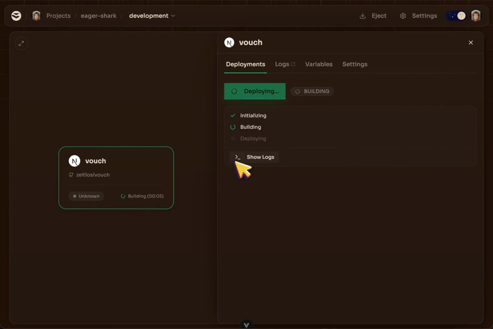
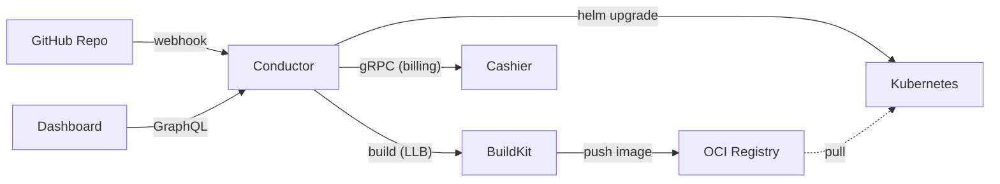

<p align="center">
  <picture>
    <source media="(prefers-color-scheme: dark)" srcset="assets/logo-dark.svg">
    
  </picture>
</p>

<h1 align="center">The PaaS you can leave.</h1>

<p align="center">
  Open-source PaaS on Kubernetes. Deploy like Railway. Eject to standard Helm & ArgoCD when you're ready.
</p>

<p align="center">
  <a href="https://github.com/zeitlos/lucity/actions/workflows/release.yml">
    
  </a>
  <a href="https://github.com/zeitlos/lucity/blob/main/LICENSE">
    
  </a>
  <a href="https://go.dev/">
    
  </a>
</p>

---

Lucity is a self-hosted PaaS that deploys your apps to Kubernetes from a GitHub repo. It gives you the developer experience of Railway or Heroku with the control of owning your infrastructure. When you're ready to move on, `lucity eject` gives you standard Helm charts and ArgoCD configs — zero lock-in, zero vendor dependency.

<p align="center">
  <a href="https://lucity.cloud">
    
  </a>
  <br>
  <sub>Deploy in 60 seconds — <a href="https://lucity.cloud">watch the full demo</a></sub>
</p>

## Why Lucity?

- **No lock-in.** `lucity eject` produces real Helm charts and ArgoCD configs — the actual infrastructure-as-code, not a proprietary dump. Try asking Railway for that.
- **No database.** The platform is stateless. All state lives in Kubernetes and your OCI registry. If Lucity goes down, your workloads keep running.
- **No magic.** Built on Kubernetes, Helm, Gateway API, and CloudNativePG. Standard `kubectl` works for everything. Nothing proprietary under the hood.
- **No compromise.** Swiss-engineered, self-hostable anywhere, AGPL-licensed. Or let us host it in Switzerland.

## Features

**Deploy**

- [x] Git push to deploy from any GitHub repo
- [x] Auto-detect language, framework, and port
- [x] Async builds with real-time log streaming
- [x] Rolling deployments with rollback

**Environments**

- [x] Development, staging, and production out of the box
- [x] Ephemeral PR preview environments
- [x] Promote between environments without rebuilding

**Infrastructure**

- [x] PostgreSQL databases via CloudNativePG
- [x] Redis instances
- [x] Cron jobs
- [x] Custom domains with DNS verification

**Operations**

- [x] Environment variables — shared, per-service, database refs
- [x] Database explorer with query execution
- [x] Deploy and service log streaming
- [x] Full GraphQL API

**Ejectability**

- [x] `lucity eject` exports your Helm charts and ArgoCD configs
- [x] Ejected output is fully self-contained — zero Lucity dependencies
- [x] Standard tools all the way down: Helm, ArgoCD, Gateway API, CloudNativePG

## Architecture


```mermaid
flowchart LR
    GH["GitHub Repo"]
    CO["Conductor"]
    BK["BuildKit"]
    ZO["OCI Registry"]
    K8["Kubernetes"]
    UI["Dashboard"]
    CA["Cashier"]

    GH -- "webhook" --> CO
    UI -- "GraphQL" --> CO
    CO -- "build (LLB)" --> BK
    BK -- "push image" --> ZO
    CO -- "helm upgrade" --> K8
    ZO -. "pull" .-> K8
    CO -- "gRPC (billing)" --> CA
```

The platform is **stateless** — no central database. All state lives in Kubernetes (namespaces, labels, Helm release state) and the OCI registry (Zot). Your source repo is read-only to the platform; deployments are applied as standard Helm releases, never written back to your repo. If the platform goes down, your workloads keep running.

## Concepts

Every Lucity concept maps to standard Kubernetes and Helm primitives — no proprietary abstractions.

| Concept | Source of Truth | Kubernetes |
|---------|----------------|------------|
| **Project** | Namespace labels | Namespaces via `lucity.dev/project` label |
| **Environment** | Helm release values | Namespace + Deployments |
| **Service** | lucity-app values (`services.{name}`) | Deployment + ClusterIP Service |
| **Database** | lucity-app values (`databases.postgres.{name}`) | CloudNativePG `Cluster` + `Secret` |
| **Build** | OCI image in Zot registry | Tagged with commit SHA |
| **Deployment** | Helm release revision | `helm upgrade` → rolling update |
| **Promotion** | Image digest copied between env values | Same digest, no rebuild |
| **Domain** | `services.{name}.domains[]` | Gateway API `HTTPRoute` |
| **Cron Job** | `cronJobs.{name}` in env values | `CronJob` |
| **Variables** | Helm values (shared, per-service, DB refs) | `ConfigMap`, pod env, CNPG `Secret` |

See [Concepts](https://lucity.cloud/getting-started/concepts) in the docs for the full breakdown.

## Quick Start

Install with Helm:

```sh
helm install lucity oci://ghcr.io/zeitlos/lucity/charts/lucity \
  --namespace lucity-system --create-namespace
```

For local development, see the [Contributing guide](CONTRIBUTING.md).

## Tech Stack

| Component | Technology |
|-----------|-----------|
| Runtime | Kubernetes |
| Builds | [railpack](https://github.com/railwayapp/railpack) + [BuildKit](https://github.com/moby/buildkit) |
| Deployments | [Helm](https://helm.sh/) (imperative releases) |
| Networking | [Gateway API](https://gateway-api.sigs.k8s.io/) (Envoy) |
| Databases | [CloudNativePG](https://cloudnative-pg.io/) |
| Registry | [Zot](https://zotregistry.dev/) (OCI) |
| API | GraphQL ([gqlgen](https://gqlgen.com/)) + gRPC |
| Dashboard | [Vue 3](https://vuejs.org/) + [Vite](https://vite.dev/) |
| Language | [Go 1.26](https://go.dev/) |

## Documentation

Full documentation at **[lucity.cloud](https://lucity.cloud)**.

- [Concepts](https://lucity.cloud/getting-started/concepts) — projects, services, environments
- [Architecture](https://lucity.cloud/architecture/how-it-works) — how the pieces fit together
- [Ejectability](https://lucity.cloud/features/eject) — what you get when you leave

## Lucity Cloud

Don't want to run Kubernetes yourself? **Lucity Cloud** is a managed version of everything above — same open-source platform, zero infrastructure to maintain.

[Join the waitlist](https://lucity.cloud/cloud) — or just self-host. We're cool either way.

## Built by zeitlos

Lucity is made by [zeitlos.software](https://zeitlos.software), a Swiss software company. If you're looking to adopt Kubernetes and want help beyond what a PaaS provides, we do that too.

## Contributing

We welcome contributions! See [CONTRIBUTING.md](CONTRIBUTING.md) for development setup, architecture overview, and how to get started.

## License

[AGPL-3.0](LICENSE)
